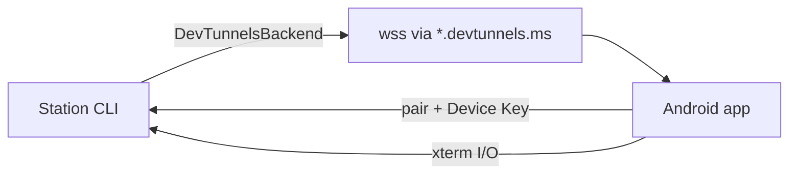

# Plan: Test the terminal using Dev Tunnels

Validate the live terminal over Microsoft Dev Tunnels with a real Android device.

Primary source: [README.md](../README.md) (Quick Start / Dev Tunnels helper). Architecture notes: [adr/0003-pluggable-tunnel-backend.md](../docs/adr/0003-pluggable-tunnel-backend.md). Latency targets: [latency-baseline.md](latency-baseline.md).



`npx mobily` always uses Dev Tunnels; there is no `--tunnel` flag.

## 1. Prerequisites

- Node ≥ 20, pnpm
- Android device with the Mobily app (dev client or build)
- From repo root:

```bash
pnpm install
pnpm build
```

- Run the README gate before manual testing:

```bash
pnpm typecheck
pnpm --filter mobily-android lint
pnpm build
pnpm --filter @mobily/shared test
pnpm --filter mobily test
pnpm --filter mobily-android exec vitest run
```

Do **not** use full `pnpm test` for this gate (Playwright under android can hang). Full `pnpm lint` may fail on unrelated CLI fixtures.

## 2. Install and auth the Dev Tunnels helper

Mobily uses Microsoft's official `devtunnel` helper (GitHub, Microsoft personal, or Entra ID). No Mobily OAuth / `MOBILY_DEVTUNNELS_*` env vars required.

If missing (WSL/Linux):

```bash
curl -sL https://aka.ms/DevTunnelCliInstall | bash
```

macOS: `brew install --cask devtunnel`  
Windows: `winget install Microsoft.devtunnel`

First run will guide login; credentials are cached by the helper.

## 3. Start Station over Dev Tunnels

```bash
npx mobily
# or from a built workspace:
# pnpm --filter mobily exec node dist/index.js
```

Optional flags:

```bash
npx mobily --session project-x
npx mobily --devtunnels-provider github
npx mobily --devtunnels-provider microsoft
npx mobily --verbose
```

Note the printed QR / pairing details. After setup, Mobily hands its console to the shared terminal. With tmux available, an additional workstation can attach:

```bash
tmux attach-session -t project-x
```

Normal shutdown detaches only; kill with `npx mobily --kill-session project-x` if needed.

**Gotcha — do not reuse the outer tmux session name as `--session`.** If you start Mobily inside `tmux` session `foo` with `--session foo`, Mux reuses that pane (the Station `node` process) instead of creating a bash shell. Pairing can still succeed and typed text may appear, but Enter produces no command output. Use a distinct launcher session and shell session, e.g. launcher `mobily-dt-launcher` with `--session mobily-dt-shell`.

**Quota cleanup if an interrupted run filled the account:**

```bash
devtunnel delete-all
```

## 4. Pair Android and exercise the terminal

1. Scan the QR (or complete the pairing flow) on Android. Phone does **not** need a Microsoft account; operator auth is only for hosting the tunnel.
2. Confirm pairing succeeds and the terminal WebView/xterm renders.
3. Verify keystrokes produce shell output on both phone and workstation mirror.
4. Optionally exercise special keys (Ctrl, Esc, arrows), reconnect, and a second `tmux attach` if using `--session`.

Device Key bindings live in `~/.mobily/device-bindings.json` (`npx mobily --list-bindings` / `--revoke-binding <id>`).

## 5. Optional latency check

Per [latency-baseline.md](latency-baseline.md): after pairing, enter ≥20 output-producing keystrokes and read P50/P95 from the status bar or `[mobily latency]` Metro log.

Dev Tunnels targets: P50 ≤ 80 ms, P95 ≤ 200 ms.

## Recommended order

1. Gates (typecheck / lint / unit tests)
2. Ensure `devtunnel` is installed and authenticated
3. Start Station (`npx mobily` / workspace `node dist/index.js`)
4. Pair Android and verify terminal I/O + shared mirror
5. Latency sample if performance is in scope
