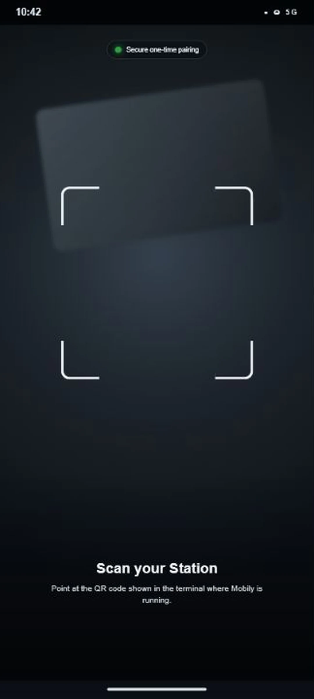
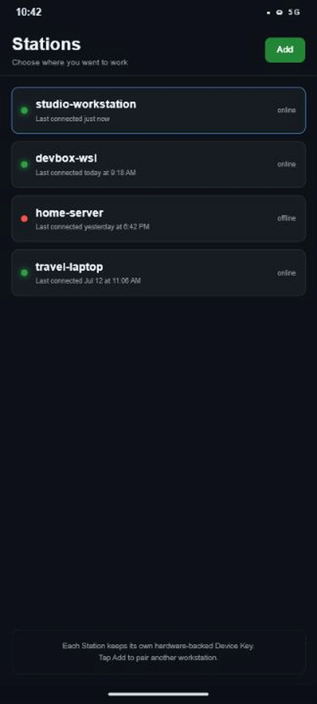

# Mobily

### Your desktop terminal, in your pocket.

Stream a live workstation terminal to Android over a tunnel you control.
Pair once with a Device Key, answer prompts from the couch, and keep Git close without typing on glass.

[](https://github.com/kirank55/mobily/actions/workflows/ci.yml)
[](LICENSE)
[](https://nodejs.org/)
[](#platform-support)
[](#platform-support)
[](https://www.npmjs.com/package/mobily)

[Releases](https://github.com/kirank55/mobily/releases/latest) · [Architecture](docs/ARCHITECTURE.md) · [Contributing](CONTRIBUTING.md) · [Security](SECURITY.md)

| Pairing | Live terminal | Stations | Git |
| --- | --- | --- | --- |
|  |  |  |  |

## Why Mobily exists

You kick off a long coding-agent session. You step away. You come back and discover it has been blocked on a tool approval or a prompt since minute two.

That human-in-the-loop moment does not need a desk. **Mobily streams your workstation terminal to your phone** so you can read context, type a reply, and keep going.

There is no Mobily-operated terminal relay. Remote access uses Microsoft Dev Tunnels (or local pinned TLS on your LAN). Pairing uses a Device Key in Android Keystore — the Station stores only the public key.

## Getting started

### 1. Start the Station

**Same Wi‑Fi (no account):**

```bash
npx mobily@latest --tunnel local
```

**Remote access (Dev Tunnels):**

```bash
npx mobily@latest --tunnel devtunnels
```

Requires [Node.js 20+](https://nodejs.org/). First-time Dev Tunnels setup may ask you to install and sign in with Microsoft’s `devtunnel` helper (GitHub or Microsoft account). The phone never needs that account.

### 2. Pair your phone

Open the Mobily Android app, scan the QR the CLI prints (or enter the pairing code). Mobily creates a Device Key in Android Keystore and binds the public key on the Station.

### 3. Use the session

Your phone shows the live terminal. When tmux is available, the Session persists across reconnects; otherwise a bare PTY mirrors Android while the CLI stays alive. Use native Git screens for diffs, staging, branches, and commits. Background alerts keep Working / Waiting / Finished status visible.

## How it works

```
Your machine                                      Your phone
┌─────────────────────────────────┐               ┌──────────────────────────┐
│  mobily Station (Node)          │  WSS / tunnel │  Mobily Android          │
│  PTY / tmux Session             │◄─────────────►│  xterm.js WebView        │
│  Device Key auth + Git RPC      │   local TLS   │  Device Key (Keystore)   │
│  Dev Tunnels or LAN             │   or Dev      │  Stations / Git / alerts │
└─────────────────────────────────┘   Tunnels     └──────────────────────────┘
```

See [docs/ARCHITECTURE.md](docs/ARCHITECTURE.md) for the package map.

## Core features

- **Live terminal** — full xterm.js on Android with Ctrl, Alt, Esc, arrows, paste, and hardware keyboard support
- **Secure pairing** — QR pairing with hardware-backed Device Keys
- **Shared persistent session** — tmux when available; bare PTY fallback with bounded replay
- **Workstation mirror** — the launching CLI can embed or attach so the same Session is visible on the desk and the phone
- **Background alerts** — Android foreground service reports phase and prompts that need attention
- **Native Git** — browse changes, stage/unstage, inspect diffs, switch branches, commit
- **Multiple Stations** — keep paired workstations and switch without scanning again
- **Pluggable tunneling** — Dev Tunnels for remote access; pinned TLS on LAN

## Privacy and security

- **No Mobily terminal relay.** Your stream follows the tunnel you configure.
- **No Mobily accounts.** Dev Tunnels may require a Microsoft/GitHub login for the helper only.
- **Device Key proof.** The phone signs challenges; the Station never receives the private key.
- **Revocation.** `npx mobily --list-bindings` / `--revoke-binding <id>` manage bindings under `~/.mobily/`.

Full reporting process: [SECURITY.md](SECURITY.md).

## Connection modes

| Mode | How it works | Command |
| --- | --- | --- |
| **Local** | Pinned TLS on your LAN; account-free | `npx mobily --tunnel local` |
| **Dev Tunnels** | Microsoft Dev Tunnels for remote access | `npx mobily --tunnel devtunnels` |

Force a Dev Tunnels provider or verbose diagnostics:

```bash
npx mobily --tunnel devtunnels --devtunnels-provider github
npx mobily --tunnel devtunnels --devtunnels-provider microsoft
npx mobily --tunnel devtunnels --verbose
```

## CLI reference

```
mobily [OPTIONS] [COMMAND]

Start a Station:
  mobily                             Secure remote access (Dev Tunnels)
  mobily --tunnel local              Account-free LAN with pinned TLS
  mobily --tunnel devtunnels         Remote via Microsoft Dev Tunnels
  mobily --session <name> …          Stable tmux session name
  mobily --kill-session <name>       End a persisted tmux session

Workstation session:
  mobily exit                        Exit Mobily from an attached tmux terminal
  mobily qr hide                     Hide the status header pane
  mobily qr clear                    Hide the header and clear the terminal

Device bindings:
  mobily --list-bindings
  mobily --revoke-binding <binding-id>

Other:
  mobily -h, --help
  mobily --verbose
```

Normal CLI shutdown detaches Mobily; it does not kill a tmux Session. Use `--kill-session` when you intend to remove it.

## Platform support

### CLI (Station)

| Platform | Status |
| --- | --- |
| **Linux** | Supported (Node ≥ 20, native PTY via `node-pty`) |
| **macOS** | Supported |
| **Windows / WSL** | Supported; develop the monorepo inside WSL |

### Mobile app

| Platform | Status |
| --- | --- |
| **Android** | Expo app in this repo — build with EAS / local Expo; beta APKs via [GitHub Releases](https://github.com/kirank55/mobily/releases) when published |
| **iOS** | Not available yet |

## Documentation

- [Architecture](docs/ARCHITECTURE.md) — package map and runtime shape
- [Local development](docs/development.md) — monorepo install and test gate
- [Domain glossary](CONTEXT.md) — canonical terminology
- [ADRs](docs/adr/) — architectural decision records
- [Contributing](CONTRIBUTING.md)
- [Changelog](CHANGELOG.md)

## License

[MIT](LICENSE)
