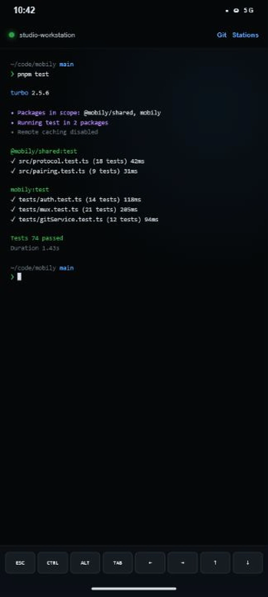
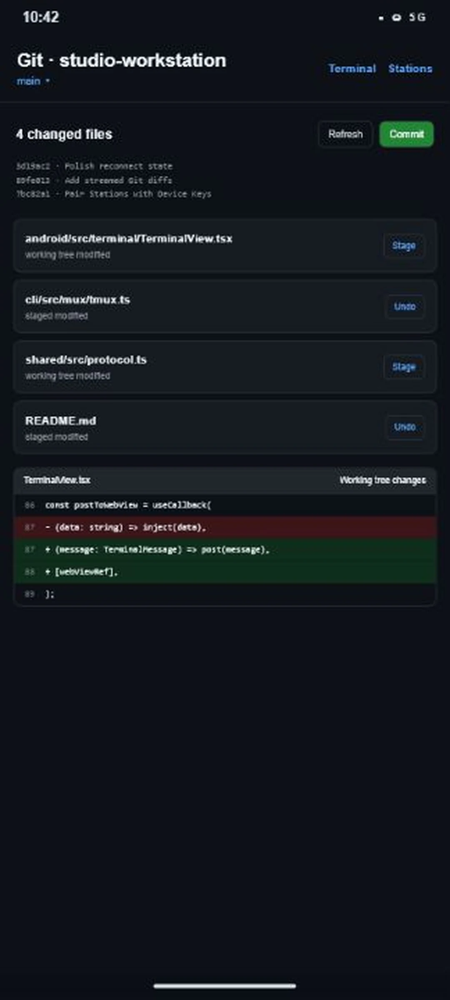

<div align="center">

# Mobily

### Your desktop terminal, in your pocket.

Stream a live workstation terminal to Android over a tunnel you control.
Pair once with a Device Key, answer prompts from the couch.

[](https://github.com/kirank55/mobily/actions/workflows/ci.yml)
[](LICENSE)
[](https://nodejs.org/)
[](#platform-support)
[](#platform-support)
[](https://www.npmjs.com/package/mobily)

[Releases](https://github.com/kirank55/mobily/releases/latest) · [Architecture](docs/ARCHITECTURE.md) · [Contributing](CONTRIBUTING.md) · [Security](SECURITY.md)

</div>

| Pairing | Live terminal | Stations | Git |
| --- | --- | --- | --- |
|  |  |  |  |

## Why Mobily exists

You start a long coding-agent session. You step away. You come back and find it has been blocked on a tool approval since minute two.

That moment does not need a desk. **Mobily puts the same live workstation terminal on your phone** — read the context, type the reply, keep going.

No Mobily-operated relay sits in the middle. Reachability is Microsoft Dev Tunnels. Trust is a Device Key in Android Keystore — the Station keeps only the public key.

## The process

Three moves. One Session.

### 1. Install and Wake the Station with One Command.

On the machine where your code and terminal live:

```bash
npx mobily@latest
```

Needs [Node.js 20+](https://nodejs.org/). First run may install and sign you into Microsoft’s `devtunnel` helper (GitHub or Microsoft). After installing the helper, reopen your terminal so `devtunnel` is on `PATH`, then run Mobily again. The phone never needs that account.

The CLI opens a Temporary Tunnel, prints a QR, and holds a Pairing Code. Your desk terminal stays the Station — the phone will join the same Session, not a copy.

### 2. Install the APK and scan the QR code to bind the phone.

Install the pre-release APK from [GitHub Releases](https://github.com/kirank55/mobily/releases), or build and run the Expo Android app from this repo:

```bash
pnpm --filter mobily-android android
```

Details: [docs/development.md](docs/development.md).

Scan the QR (or type the 8-character code). Mobily mints a Device Key in Android Keystore and sends **only the public key** to the Station. After that, reconnects are signed challenges — no re-scan every time you leave the couch.

### 3. That's it. Stay in the loop.

Your phone paints the live xterm.js grid: same Session Snapshot, same input path, Ctrl / Alt / Esc / arrows when you need them.

- **Waiting on a prompt?** Answer it from Android.
- **Need Git for a small moment?** Diff, stage, branch, commit on phone-sized screens.
- **Step away again?** An ongoing foreground notification keeps the Session connected while the app sits in the background.
- **Several machines?** Keep them as Stations and switch without pairing again.

With `tmux`, the Session survives reconnects and CLI restarts. Without it, a bare PTY stays alive while the CLI process does.

## How the path works

```
  Your machine               Reachability              Your phone
┌──────────────────────┐   ┌────────────────┐   ┌──────────────────────┐
│ Station (Node CLI)   │   │                │   │ Mobily Android       │
│                      │WSS│   Microsoft    │WSS│                      │
│ · PTY / tmux Session │◄─►│  Dev Tunnels   │◄─►│ · xterm.js WebView   │
│ · Device Key auth    │   │                │   │ · Device Key         │
│ · Git RPC            │   │                │   │ · Stations / Git     │
└──────────┬───────────┘   └────────────────┘   └──────────┬───────────┘
           │                                                │
           └───── same Session · snapshot, then live ───────┘
                 Device Key proves the phone on reconnect
```

1. **Station** runs the PTY (tmux when available) and serves the wire protocol.
2. **Dev Tunnels** makes that WebSocket reachable; Mobily does not host a terminal cloud.
3. **Device Key** proves the phone on every reconnect before any bytes or input flow.
4. **Session Snapshot** lands first so Android shows the real screen, then live output follows.

Package map: [docs/ARCHITECTURE.md](docs/ARCHITECTURE.md).

## Core features

- **Live terminal** — full xterm.js on Android with Ctrl, Alt, Esc, arrows, paste, and hardware keyboard support
- **Secure pairing** — QR pairing with hardware-backed Device Keys
- **Shared persistent session** — tmux when available; bare PTY fallback with bounded replay
- **Workstation mirror** — the launching CLI can embed or attach so the same Session is visible on the desk and the phone
- **Background presence** — Android foreground service keeps the Session connected in the background and shows connection state
- **Native Git** — browse changes, stage/unstage, inspect diffs, switch branches, commit
- **Multiple Stations** — keep paired workstations and switch without scanning again
- **Dev Tunnels transport** — Microsoft Dev Tunnels for phone reachability; the Station keeps a pluggable tunnel interface for future backends

## Privacy and security

- **No Mobily terminal relay.** Your stream travels over Microsoft Dev Tunnels; Mobily does not operate a cloud that sees your PTY.
- **No Mobily accounts.** Dev Tunnels may require a Microsoft/GitHub login for the helper only.
- **Device Key proof.** The phone signs challenges; the Station never receives the private key.
- **Revocation.** `npx mobily --list-bindings` / `--revoke-binding <id>` manage bindings under `~/.mobily/`.

Full reporting process: [SECURITY.md](SECURITY.md).

## Dev Tunnels options

Force a login provider or verbose diagnostics:

```bash
npx mobily --devtunnels-provider github
npx mobily --devtunnels-provider microsoft
npx mobily --verbose
```

## CLI reference

```
mobily [OPTIONS] [COMMAND]

Start a Station:
  mobily                             Secure remote access (Dev Tunnels)
  mobily --session <name> …          Stable tmux session name
  mobily --kill-session <name>       End a persisted tmux session

Workstation session:
  mobily exit                        Exit Mobily from an attached tmux terminal
  mobily qr hide                     Hide the status header pane
  mobily qr clear                    Hide the header and clear the terminal

Device bindings:
  mobily --list-bindings
  mobily --revoke-binding <binding-id>

Other:
  mobily -h, --help
  mobily --version
  mobily --verbose
  mobily --devtunnels-provider github|microsoft
```

Normal CLI shutdown detaches Mobily; it does not kill a tmux Session. Use `--kill-session` when you intend to remove it.

## Platform support

### CLI (Station)

| Platform | Status |
| --- | --- |
| **Linux** | Supported (Node ≥ 20, native PTY via `node-pty`) |
| **macOS** | Supported |
| **Windows / WSL** | Supported; develop the monorepo inside WSL |

### Mobile app

| Platform | Status |
| --- | --- |
| **Android** | Pre-release APK on [GitHub Releases](https://github.com/kirank55/mobily/releases), or build the Expo app locally with Expo / EAS (`pnpm --filter mobily-android android`; see [docs/development.md](docs/development.md)). Tagged `v*` releases publish the CLI to npm. |
| **iOS** | Not available yet |

## Documentation

- [Architecture](docs/ARCHITECTURE.md) — package map and runtime shape
- [Local development](docs/development.md) — monorepo install and test gate
- [Domain glossary](CONTEXT.md) — canonical terminology
- [ADRs](docs/adr/) — architectural decision records
- [Contributing](CONTRIBUTING.md)
- [Changelog](CHANGELOG.md)

## License

[MIT](LICENSE)
