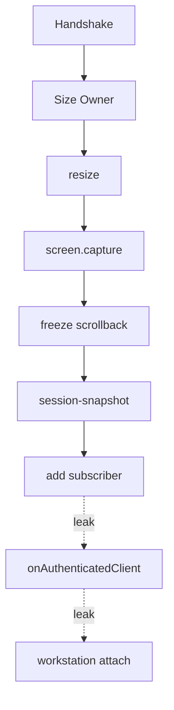

# Architecture review — deep-module friction

22 Jul 2026. Vocabulary: **module**, **interface**, **implementation**, **depth**, **seam**, **adapter**, **leverage**, **locality** (see `/codebase-design`). Domain terms from `CONTEXT.md`.

Leave alone: `CanonicalTerminalScreen`, `TunnelBackend`, `CliLifecycle`, `SessionBackend` seam, `BindingRepository`, `encodeFrame` / `decodeFrame`, `RpcClient`, `AuthManager` pair/challenge core.

## Top recommendation

**Deepen authenticated Session Snapshot delivery** (candidate 1).

It owns the ADR-0004 contract; known attach-ordering P1s are locality failures of this cluster; fixing it clarifies what the Mobile Client pipeline must consume and unblocks safe workstation presence deepening.

---

## 1. Deepen authenticated Session Snapshot delivery

**Strength:** Strong · **Category:** in-process

**Files:** `cli/src/session.ts`, `cli/src/terminal/screen.ts`, `cli/src/index.ts`

**Problem.** ADR-0004 ordering has no locality — callers must know attach phases; workstation listeners fire after Snapshot and mutate the Session.

**Solution.** One module owns the authenticated viewer lifecycle (auth-ok → Terminal Size Owner → dimensions → Session Snapshot → live → scrollback). Shell Backend and Canonical Terminal Screen stay internal seams.

**Wins**

- locality: ordering bugs concentrate
- leverage: one interface, N viewers
- tests hit one attach seam
- P1 attach races become in-module

Deepen to a single viewer-attach interface with capture queue, freeze, and workstation timing internal.

---

## 2. Collapse Mobile Client Snapshot apply pipeline

**Strength:** Strong · **Category:** in-process

**Files:** `android/src/client/wsClient.ts`, `android/src/client/sessionSnapshotChannel.ts`, `android/src/app/terminal.tsx`, `android/src/terminal/TerminalView.tsx`, `android/src/terminal/terminalDocument.js`

**Problem.** Snapshot → first paint → ack → scrollback is split across six modules; `SessionSnapshotChannel` fails the deletion test (complexity vanishes into a listener set).

**Solution.** One Mobile Client module from frames in to overlay/terminal outcomes out; collapse the pub/sub shim and route glue.

**Wins**

- delete shallow channel module
- locality: stuck Loading bugs
- interface is the test surface
- leverage across reconnect paths

---

## 3. Deepen Station workstation presence

**Strength:** Strong · **Category:** local-substitutable

**Files:** `cli/src/index.ts`, `cli/src/workstationTerminal.ts`, `cli/src/tmuxWorkstationAttach.ts`, `cli/src/mux/tmux.ts`

**Problem.** Pairing panel, bare TTY, and tmux attach are parallel stories; tiny predicates hide duplicated `beginWorkstation` orchestration in `main`.

**Solution.** One Station workstation presence module (backend kind + TTY → Pairing panel → post-auth attach). Coordinate with candidate 1 so attach cannot rewrite the screen after Snapshot.

**Wins**

- locality: ADR-0002 attach behavior
- delete duplicated closures
- seam with Snapshot delivery
- leverage: bare + tmux adapters

> Attach-after-Snapshot mutation fights ADR-0004 — deepen with candidate 1; do not reopen ADR-0002.

---

## 4. Delete dead Terminal Size Ownership controller

**Strength:** Worth exploring · **Category:** in-process

**Files:** `android/src/terminal/sizeOwnership.ts`, `android/src/client/wsClient.ts`, `android/tests/terminalSizeOwnership.test.ts`

**Problem.** Full claim/lease module encodes old policy; live wiring ignores it — deletion test passes (production behavior unchanged).

**Solution.** Delete or quarantine. Deepen Fit / viewport inside the terminal document if needed — do not deepen the claim controller.

**Wins**

- removes reintroduction risk
- aligns with ADR-0004 policy
- tests stop covering dead path

> Contradicts ADR-0004 (“Android does not claim”) — leftover interface invites reopening. Surface to delete, not deepen.

---

## 5. Tighten Shell Backend visible Capture Mode

**Strength:** Worth exploring · **Category:** ports & adapters

**Files:** `cli/src/mux/types.ts`, `cli/src/mux/bare.ts`, `cli/src/mux/tmux.ts`, `cli/src/mux/scrollback.ts`

**Problem.** Interface says visible ≠ scrollback; bare `captureVisibleScreen` is the transcript — callers must know adapter semantics.

**Solution.** Keep the Shell Backend seam (two adapters justify it). Deepen visible Capture Mode so both return the same attributed ANSI reconstruction kind; dedupe PTY fan-out.

**Wins**

- seam stops leaking Capture Mode
- locality inside mux package
- leverage: Canonical screen unchanged

---

## 6. Treat Pairing as one Binding Ceremony module

**Strength:** Worth exploring · **Category:** ports & adapters

**Files:** `android/src/auth/pairing.ts`, `android/src/auth/deviceKey.ts`, `android/src/auth/storage.ts`, `android/src/client/pinnedTransport.ts`, `cli/src/auth.ts`

**Problem.** Pure helpers are well-tested; Binding Ceremony bugs live in call order across Device Key, transport, and storage.

**Solution.** Make `pairWithStation` the deep external seam (`PairingPayload` → `PairResult`); prefer ceremony-level tests over more proof-string units.

**Wins**

- locality: ceremony failures
- UI learns one interface
- two adapters justify Keystore seam

---

## 7. Unify Session Binding admin through one seam

**Strength:** Speculative · **Category:** ports & adapters

**Files:** `cli/src/auth.ts`, `cli/src/bindings.ts`, `cli/src/index.ts`

**Problem.** `AuthManager` list/revoke wrappers fail the deletion test — all depth sits in `BindingRepository`. CLI flags talk to the repository directly; tests go through wrappers.

**Solution.** One admin seam only (`AuthManager` XOR repository). Keep crypto + Pairing depth in `AuthManager` where it already earns its keep.

**Wins**

- delete pass-through methods
- Memory + File adapters stay
